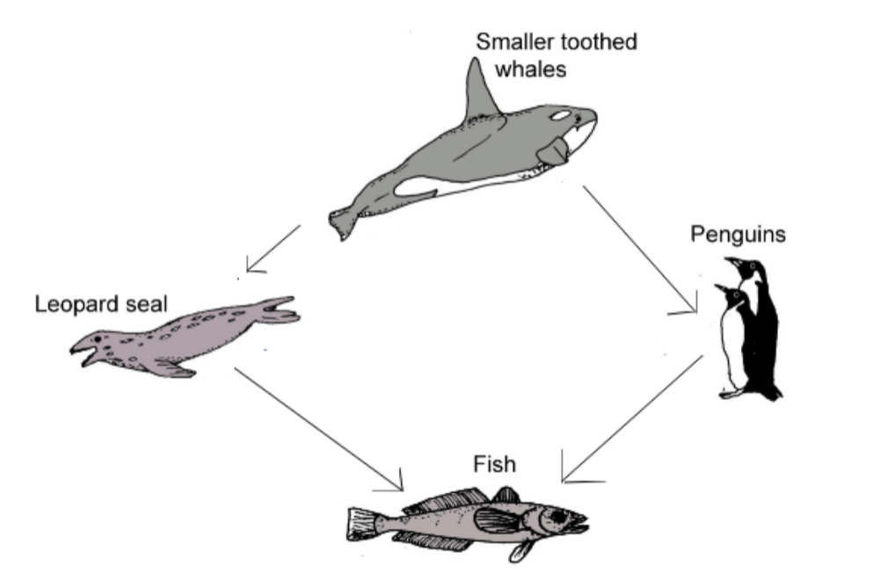

## Antarctica

Simulation of a small very simplified section of the Antarctic ecosystem.
In accordance with the hierarchy shown above, they can eat each other moving around the world.
You need to control the penguin and help him find his relative.
The game is over if one of the penguins has died, or the penguins have found each other

